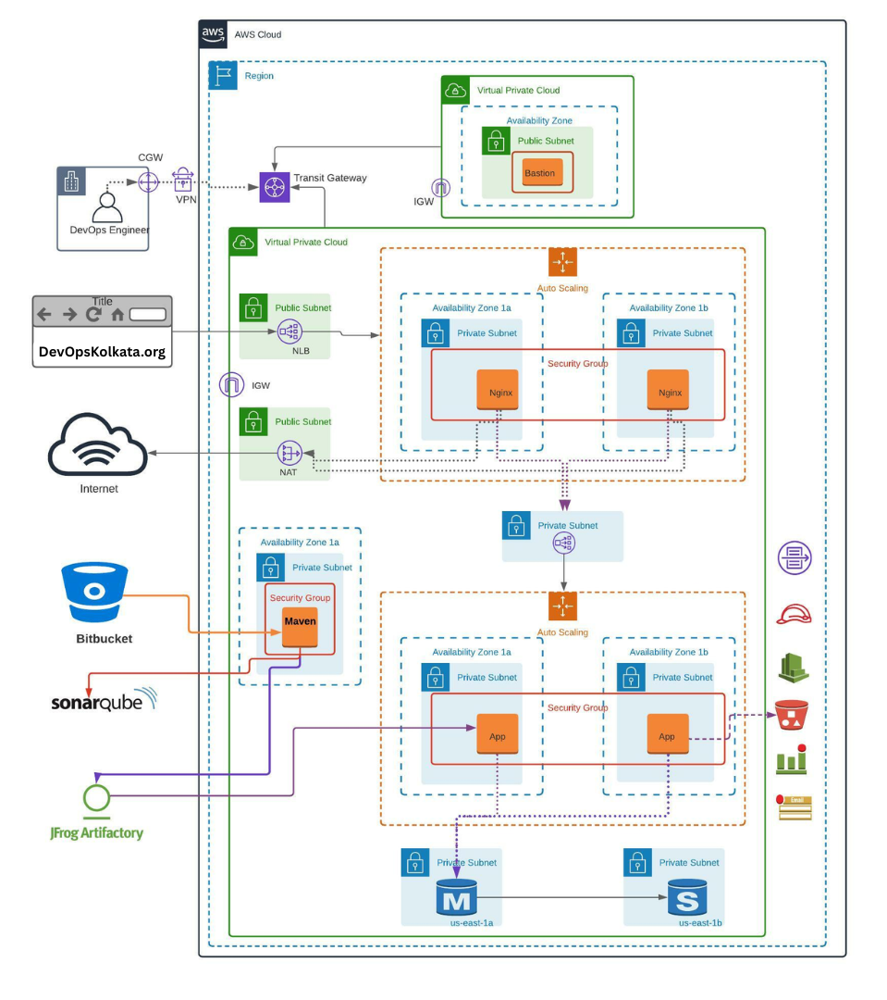

# 🏗️ Production-Grade AWS 3-Tier Architecture with Auto Scaling — Terraform

[](https://www.terraform.io/)
[](https://aws.amazon.com/)
[](LICENSE)
[](https://www.linkedin.com/in/arbindmahato/)

> Enterprise-grade, fully automated AWS infrastructure for deploying a Java-based web application using a secure, scalable, and highly available 3-tier architecture — provisioned entirely with Terraform.

---

## 📐 Architecture Overview

<p align="center">
  
</p>

```
                         ┌──────────────┐
                         │  CloudFront   │ (Optional CDN)
                         └──────┬───────┘
                                │
                         ┌──────▼───────┐
                         │   AWS WAF     │
                         └──────┬───────┘
                                │
                    ┌───────────▼───────────┐
                    │  Internet Gateway (IGW)│
                    └───────────┬───────────┘
                                │
          ┌─────────────────────┼─────────────────────┐
          │              Public Subnets                │
          │  ┌────────────┐           ┌────────────┐  │
          │  │  Bastion    │           │  Bastion    │  │
          │  │  Host (AZ1) │           │  Host (AZ2) │  │
          │  └─────┬──────┘           └─────┬──────┘  │
          │        │    ┌──────────────┐    │         │
          │        │    │ External ALB │    │         │
          │        │    │(Internet-Facing)│  │         │
          │        │    └──────┬───────┘    │         │
          └────────┼───────────┼────────────┼─────────┘
                   │           │            │
          ┌────────▼───────────▼────────────▼─────────┐
          │           Private Subnets (Web Tier)       │
          │                                            │
          │  ┌──── AZ: us-east-1a ────┐  ┌──── AZ: us-east-1b ────┐
          │  │  ┌──────────────────┐  │  │  ┌──────────────────┐  │
          │  │  │   Nginx (ASG)    │  │  │  │   Nginx (ASG)    │  │
          │  │  └────────┬─────────┘  │  │  └────────┬─────────┘  │
          │  └───────────┼────────────┘  └───────────┼────────────┘
          └──────────────┼───────────────────────────┼─┘
                         │                           │
               ┌─────────▼───────────────────────────▼──┐
               │          Internal ALB                   │
               └─────────┬───────────────────────────┬──┘
                         │                           │
          ┌──────────────▼────────────┐  ┌───────────▼─────────────┐
          │  Private Subnets (App)    │  │  Private Subnets (App)  │
          │  ┌──────────────────┐     │  │  ┌──────────────────┐   │
          │  │  Tomcat (ASG)    │     │  │  │  Tomcat (ASG)    │   │
          │  └────────┬─────────┘     │  │  └────────┬─────────┘   │
          └───────────┼───────────────┘  └───────────┼─────────────┘
                      │                              │
          ┌───────────▼──────────────────────────────▼──┐
          │       Private Subnets (Data — Isolated)     │
          │  ┌──────────────┐      ┌──────────────┐     │
          │  │ RDS MySQL    │      │ RDS MySQL    │     │
          │  │ (Primary)    │      │ (Standby)    │     │
          │  └──────────────┘      └──────────────┘     │
          └─────────────────────────────────────────────┘
```

---

## 📋 Project Overview

### Executive Summary

The client intends to deploy a **production-grade Java-based web application** on AWS leveraging a secure, scalable, and highly available 3-tier architecture.

The proposed solution is designed to:
- ✅ Ensure **high availability** across multiple Availability Zones
- ✅ Enable **dynamic scalability** using Auto Scaling Groups
- ✅ Enforce **security best practices** across all layers
- ✅ Integrate **CI/CD pipelines** for automated deployments

> 📌 The solution adopts a multi-tier architecture with clear separation of presentation, application, and data layers, ensuring modular scalability and fault isolation.

### Scope of Work

DevOps Team will design and implement a cloud-native infrastructure on AWS for hosting the application, including:
- Network architecture design (VPC, subnets, routing)
- Compute layer provisioning (EC2 with Auto Scaling)
- Load balancing and traffic distribution
- Database deployment and configuration (Amazon RDS)
- CI/CD pipeline integration
- Monitoring, logging, and alerting setup
- Security hardening and compliance alignment

### Customer Requirements

- Deploy Java application using a 3-tier architecture
- Implement high availability and fault tolerance
- Enable auto scaling based on workload demand
- Integrate DevOps tools for CI/CD
- Ensure secure and compliant infrastructure

> 📌 The project leverages tools such as **Nginx**, **Apache Tomcat**, **Amazon RDS**, **SonarQube**, and **JFrog Artifactory** for a complete DevOps lifecycle.

---

### Three Tiers

| Tier | Component | Subnet | Scaling |
|------|-----------|--------|---------|
| **Presentation** | Nginx Web Servers | Private | Auto Scaling Group (2–6 instances) |
| **Application** | Apache Tomcat (Java/Spring Boot) | Private | Auto Scaling Group (2–6 instances) |
| **Data** | Amazon RDS MySQL (Multi-AZ) | Private (Isolated) | Vertical + Read Replicas |

### Access & Management

| Component | Subnet | Purpose |
|-----------|--------|---------|
| **Bastion Host** | Public | SSH jump box to access all private-tier instances |
| **External ALB** | Public | Internet-facing load balancer routing traffic to Nginx |
| **NAT Gateway** | Public | Outbound internet access for private subnets |

---

## 🔄 Complete Traffic Flow (Step by Step)

Understanding how a user request travels through the entire infrastructure:

```
Step 1: User types the URL in browser
        ↓
Step 2: DNS resolves to External ALB's public IP
        ↓
Step 3: AWS WAF inspects the request FIRST
        - Is this IP sending > 2000 requests/5min? → BLOCK (rate limiting)
        - Does the request contain SQL injection patterns? → BLOCK
        - Does it match known bad input patterns? → BLOCK
        - Clean request? → ALLOW, pass to ALB
        ↓
Step 4: External ALB (internet-facing, lives in PUBLIC subnet)
        - Receives the request on port 80
        - Runs health check: "Is Nginx healthy?"
        - Picks a healthy Nginx instance using round-robin
        - Forwards request to Nginx on port 80
        ↓
Step 5: Nginx (lives in PRIVATE web subnet — NO public IP)
        - Receives request from ALB
        - Adds security headers:
          • X-Frame-Options: SAMEORIGIN (prevents clickjacking)
          • X-Content-Type-Options: nosniff (prevents MIME sniffing)
          • X-XSS-Protection: 1; mode=block
        - Acts as reverse proxy → forwards to Internal ALB on port 8080
        ↓
Step 6: Internal ALB (lives in PRIVATE app subnet)
        - Receives request from Nginx
        - Picks a healthy Tomcat instance
        - Forwards to Tomcat on port 8080
        ↓
Step 7: Tomcat (lives in PRIVATE app subnet — NO public IP)
        - Java/Spring Boot app processes the request
        - Needs data? Connects to RDS on port 3306
        ↓
Step 8: RDS MySQL (lives in ISOLATED private subnet — NO internet at all)
        - Processes the SQL query
        - Returns data to Tomcat
        ↓
Step 9: Response travels back:
        RDS → Tomcat → Internal ALB → Nginx → External ALB → User
```

> 📌 At no point does the user's request directly touch Nginx, Tomcat, or RDS. Everything goes through load balancers. This is the **defense-in-depth** model.

---

## 🏛️ Solution Architecture & Implementation

### Target Architecture on AWS

The proposed architecture consists of the following layers:

**Presentation Layer**
- Nginx Web Servers deployed in Auto Scaling Groups
- Internet-facing Application Load Balancer
- CloudFront (optional) for content delivery

**Application Layer**
- Apache Tomcat servers hosted on EC2 instances
- Internal Load Balancer for service communication
- Stateless application design for scalability

**Data Layer**
- Amazon RDS (MySQL) in Multi-AZ configuration
- Automated backups and failover support
- Optional caching layer using Amazon ElastiCache

**DevOps & Integration Layer**
- Source Code Management (Git-based repository)
- Code Quality Analysis (SonarQube)
- Artifact Management (JFrog Artifactory)

> 📌 The architecture highlights segregation of public and private subnets, secure communication between layers, and integration with CI/CD tools.

### Implementation Approach

The implementation will be executed in structured phases:

**Phase 1: Network & Foundation Setup**
- Provision Virtual Private Cloud (VPC)
- Configure public and private subnets across multiple AZs
- Attach Internet Gateway and configure NAT Gateway
- Establish route tables and network segmentation

**Phase 2: Security Configuration**
- Define Security Groups and Network ACLs
- Configure IAM roles and policies with least privilege access
- Implement secure access mechanisms (SSH via Bastion Host)

**Phase 3: Database Deployment**
- Deploy Amazon RDS MySQL instance (Multi-AZ)
- Configure database parameters and storage
- Enable automated backups and monitoring

**Phase 4: Application Deployment**
- Install and configure:
  - Apache Tomcat (backend services)
  - Nginx (frontend proxy)
- Deploy application artifacts
- Configure reverse proxy routing

**Phase 5: Load Balancing & Auto Scaling**
- Configure Application Load Balancer (ALB)
- Create target groups and health checks
- Implement Auto Scaling Groups with dynamic scaling policies

**Phase 6: CI/CD Integration**
- Integrate source repository with pipeline
- Configure SonarQube for code quality checks
- Setup artifact repository for build storage
- Enable automated deployment pipelines

**Phase 7: Monitoring & Observability**
- Configure Amazon CloudWatch for metrics and logs
- Set up alarms for system health and performance
- Implement centralized logging strategy

**Phase 8: Security & Compliance**
- Enable encryption at rest and in transit
- Implement AWS WAF and Shield (if required)
- Enable VPC Flow Logs and audit logging
- Apply security best practices across all layers

---

## 🚀 Key Features

- **High Availability** — Multi-AZ deployment across `us-east-1a` and `us-east-1b` with automated failover
- **Auto Scaling** — Dynamic scaling policies based on CPU utilization for both web and app tiers
- **Bastion Host Access** — Secure SSH access to private instances via a hardened bastion host in the public subnet
- **Defense-in-Depth Security** — Security Groups, NACLs, IAM least-privilege roles, VPC Flow Logs, WAF, and encryption
- **Infrastructure as Code** — 100% Terraform-managed, modular, reusable, and version-controlled
- **CI/CD Ready** — Integrated with SonarQube (code quality) and JFrog Artifactory (artifact management)
- **Observability** — CloudWatch metrics, alarms, custom memory metrics, and centralized log aggregation
- **Cost Optimized** — Right-sized instances (`t3.micro`), scheduled scaling, and efficient resource utilization

---

## 🗂️ Project Structure

```
production-grade-aws-3tier-autoscaling-terraform/
├── modules/
│   ├── vpc/                    # VPC, Subnets, IGW, NAT, Route Tables, Flow Logs
│   ├── security/               # Security Groups, NACLs, IAM Roles
│   ├── bastion/                # Bastion Host in Public Subnet
│   ├── alb/                    # Application Load Balancers (External + Internal)
│   ├── asg/                    # Launch Templates, Auto Scaling Groups, Scaling Policies
│   ├── rds/                    # RDS MySQL Multi-AZ, Secrets Manager, Parameter Groups
│   ├── monitoring/             # CloudWatch Dashboards, Alarms, SNS, Log Groups
│   └── waf/                    # AWS WAF Rules and Web ACL
├── environments/
│   ├── dev/                    # Dev environment tfvars
│   ├── staging/                # Staging environment tfvars
│   └── prod/                   # Production environment tfvars
├── scripts/
│   ├── userdata-nginx.sh       # Nginx bootstrap script
│   ├── userdata-tomcat.sh      # Tomcat bootstrap script
│   └── memory-metrics.sh       # Custom CloudWatch metric script
├── docs/                       # SOW, architecture diagrams, references
├── main.tf                     # Root module composition
├── variables.tf                # Input variables
├── outputs.tf                  # Output values
├── providers.tf                # AWS provider configuration
├── backend.tf                  # S3 + DynamoDB remote state
├── .gitignore
├── LICENSE
└── README.md
```

### Module Responsibilities

| Module | Files | What It Provisions |
|--------|-------|--------------------|
| `modules/vpc/` | 3 | VPC, 8 subnets, IGW, 2 NAT GWs, route tables, VPC Flow Logs |
| `modules/security/` | 3 | 6 Security Groups, NACLs per tier, IAM role + instance profile |
| `modules/bastion/` | 3 | Bastion EC2 in public subnet, hardened with IMDSv2 |
| `modules/alb/` | 3 | External ALB + Internal ALB, target groups, health checks, listeners |
| `modules/asg/` | 3 | Launch templates + ASGs for Nginx & Tomcat, scaling policies + alarms |
| `modules/rds/` | 3 | RDS MySQL Multi-AZ, Secrets Manager, parameter group, subnet group |
| `modules/monitoring/` | 3 | SNS topic, CloudWatch alarms (RDS/ALB), dashboard, log groups |
| `modules/waf/` | 3 | WAF Web ACL with rate limiting + AWS managed rules |

---

## 🌐 Network Deep Dive

### VPC Structure

```
VPC: 10.0.0.0/16 (65,536 IP addresses)
│
├── Public Subnets (internet-accessible)
│   ├── 10.0.1.0/24 (AZ-1a) — Bastion, NAT GW, External ALB
│   └── 10.0.2.0/24 (AZ-1b) — Bastion, NAT GW, External ALB
│
├── Private Web Subnets (Nginx — no public IP)
│   ├── 10.0.11.0/24 (AZ-1a)
│   └── 10.0.12.0/24 (AZ-1b)
│
├── Private App Subnets (Tomcat — no public IP)
│   ├── 10.0.21.0/24 (AZ-1a)
│   └── 10.0.22.0/24 (AZ-1b)
│
└── Private DB Subnets (RDS — FULLY ISOLATED, no internet at all)
    ├── 10.0.31.0/24 (AZ-1a)
    └── 10.0.32.0/24 (AZ-1b)
```

### Why 8 Subnets?

Each tier gets its own subnet pair (one per AZ) because:
- **Isolation**: Different NACLs per tier
- **Blast radius**: If web tier is compromised, app/db subnets have separate firewall rules
- **Compliance**: Many audits require network-level separation between tiers
- **Independent scaling**: Each tier can grow without IP conflicts

### Route Tables — Who Can Reach What?

```
Public Route Table:
  10.0.0.0/16  → local (VPC internal)
  0.0.0.0/0    → Internet Gateway         ← Makes it "public"

Private Route Table (AZ-1a):
  10.0.0.0/16  → local (VPC internal)
  0.0.0.0/0    → NAT Gateway (AZ-1a)      ← Can reach internet for updates,
                                              but internet CANNOT reach back in

Private Route Table (AZ-1b):
  10.0.0.0/16  → local (VPC internal)
  0.0.0.0/0    → NAT Gateway (AZ-1b)      ← Separate NAT GW for HA

DB Route Table:
  10.0.0.0/16  → local (VPC internal)     ← THAT'S IT. No internet route.
                                              DB can only talk within the VPC.
```

**Why 2 NAT Gateways?** If you use one NAT GW in AZ-1a and that AZ goes down, all private instances in AZ-1b lose internet access (can't download updates, can't push CloudWatch metrics). With one per AZ, each AZ is self-sufficient.

**Why DB has no NAT route?** The database should NEVER need to reach the internet. It only needs to talk to Tomcat instances within the VPC. Even if someone compromises the DB, they can't exfiltrate data to the internet.

### VPC Flow Logs

Every network packet in the VPC is logged:
```
Source IP → Destination IP → Port → Protocol → Accept/Reject → Timestamp
```
Stored in CloudWatch Logs with 30-day retention. Useful for security forensics, troubleshooting, and compliance audits.

---

## 🔐 Security Deep Dive

### Security Group Chain (The Trust Chain)

This is the most critical security design. Each SG only allows traffic from the previous tier's SG:

```
                    ┌─────────────────────────────────────────────┐
                    │         SECURITY GROUP CHAIN                │
                    │                                             │
  Internet ──80/443──→ [External ALB SG]                         │
                    │       │                                     │
                    │       ├──80──→ [Web SG] (Nginx)             │
                    │       │           │                         │
                    │       │           ├──8080──→ [Internal ALB SG]
                    │       │           │              │          │
                    │       │           │              ├──8080──→ [App SG] (Tomcat)
                    │       │           │              │              │
                    │       │           │              │              ├──3306──→ [DB SG] (RDS)
                    │       │           │              │              │
  Trusted IP ──22──→ [Bastion SG]──22──→ [Web SG]     │              │
                    │              ──22──→ [App SG]    │              │
                    └─────────────────────────────────────────────┘
```

### Security Group Rules Explained

**Bastion SG:**
| Direction | Port | Source | Why |
|-----------|------|--------|-----|
| Inbound | 22 (SSH) | `allowed_ssh_cidrs` only | Only your trusted IP can attempt SSH |
| Outbound | All | 0.0.0.0/0 | Needs to SSH into private instances |

**External ALB SG:**
| Direction | Port | Source | Why |
|-----------|------|--------|-----|
| Inbound | 80 (HTTP) | 0.0.0.0/0 | Must accept traffic from entire internet |
| Inbound | 443 (HTTPS) | 0.0.0.0/0 | Must accept traffic from entire internet |
| Outbound | All | 0.0.0.0/0 | Forwards to Nginx |

**Web SG (Nginx):**
| Direction | Port | Source | Why |
|-----------|------|--------|-----|
| Inbound | 80 | External ALB SG | HTTP only from ALB — NOT from internet directly |
| Inbound | 22 | Bastion SG | SSH only from Bastion — not from anywhere else |
| Outbound | All | 0.0.0.0/0 | Forwards to Internal ALB |

**Internal ALB SG:**
| Direction | Port | Source | Why |
|-----------|------|--------|-----|
| Inbound | 8080 | Web SG | Only Nginx can send traffic here |
| Outbound | All | 0.0.0.0/0 | Forwards to Tomcat |

**App SG (Tomcat):**
| Direction | Port | Source | Why |
|-----------|------|--------|-----|
| Inbound | 8080 | Internal ALB SG | Only Internal ALB can reach Tomcat |
| Inbound | 22 | Bastion SG | SSH only from Bastion |
| Outbound | All | 0.0.0.0/0 | Connects to RDS, pushes CloudWatch metrics |

**DB SG (RDS):**
| Direction | Port | Source | Why |
|-----------|------|--------|-----|
| Inbound | 3306 | App SG only | ONLY Tomcat can talk to the database |
| Outbound | All | VPC only | No internet route — responses stay within VPC |

### What Happens If Nginx Is Compromised?

- Attacker can reach Internal ALB on 8080 — that's it
- They **CANNOT** reach RDS (DB SG only allows from App SG)
- They **CANNOT** SSH to Tomcat (App SG only allows SSH from Bastion SG)
- The blast radius is contained to the web tier

### NACLs (Network ACLs) — Second Layer of Defense

NACLs are **stateless** firewalls at the subnet level (SGs are stateful):

**Web NACL:**
```
Inbound:
  Rule 100: Allow TCP 80 from VPC CIDR (HTTP from ALB)
  Rule 110: Allow TCP 22 from VPC CIDR (SSH from Bastion)
  Rule 200: Allow TCP 1024-65535 from 0.0.0.0/0 (return traffic)
Outbound:
  Rule 100: Allow ALL outbound
```

**App NACL:**
```
Inbound:
  Rule 100: Allow TCP 8080 from VPC CIDR (Tomcat from Internal ALB)
  Rule 110: Allow TCP 22 from VPC CIDR (SSH from Bastion)
  Rule 200: Allow TCP 1024-65535 from 0.0.0.0/0 (return traffic)
Outbound:
  Rule 100: Allow ALL outbound
```

**DB NACL (Most Restrictive):**
```
Inbound:
  Rule 100: Allow TCP 3306 from VPC CIDR (MySQL from App tier)
  Rule 200: Allow TCP 1024-65535 from VPC CIDR (return traffic)
Outbound:
  Rule 100: Allow TCP 1024-65535 to VPC CIDR ONLY (responses back)
```

> 📌 **Why both SGs AND NACLs?** Defense in depth. If someone misconfigures a Security Group, the NACL is still there as a safety net. NACLs are evaluated BEFORE SGs.

### Additional Security Measures

| Measure | Implementation | Why |
|---------|---------------|-----|
| **IMDSv2 Enforced** | `http_tokens = "required"` on all EC2 | Prevents SSRF attacks (like the Capital One breach) |
| **EBS Encryption** | `encrypted = true` on all volumes | Data at rest protection — required for SOC2/HIPAA/PCI-DSS |
| **RDS Encryption** | `storage_encrypted = true` | Database data encrypted with AWS KMS |
| **Secrets Manager** | Auto-generated 24-char password | DB credentials never in code or Terraform state |
| **IAM Least Privilege** | Only SSM + CloudWatch policies | EC2 instances can't access S3, RDS, or other services |
| **VPC Flow Logs** | All traffic logged to CloudWatch | Network forensics and compliance auditing |
| **WAF** | Rate limiting + managed rule sets | Blocks SQL injection, bad bots, DDoS attempts |

---

## 🔄 Auto Scaling Deep Dive

### How Scaling Works

```
Normal Load              High Load (CPU > 70%)         Low Load (CPU < 30%)
┌──────────┐             ┌──────────┐                  ┌──────────┐
│ Instance │             │ Instance │                  │ Instance │
│    1     │             │    1     │                  │    1     │
├──────────┤             ├──────────┤                  ├──────────┤
│ Instance │             │ Instance │                  │ Instance │
│    2     │             │    2     │                  │    2     │
└──────────┘             ├──────────┤                  └──────────┘
min=2, desired=2         │ Instance │ ← NEW            desired=2 (back to min)
                         │    3     │   (scale out)    Instance 3 terminated
                         └──────────┘
```

### Scaling Policy Details

| Parameter | Value | Explanation |
|-----------|-------|-------------|
| **Metric** | Average CPU | Across all instances in the ASG |
| **Scale Out Threshold** | > 70% | For 2 consecutive periods of 120 seconds (4 min total) |
| **Scale Out Action** | Add 1 instance | Conservative — prevents over-provisioning |
| **Scale In Threshold** | < 30% | For 2 consecutive periods of 120 seconds |
| **Scale In Action** | Remove 1 instance | Gradual scale-down |
| **Cooldown** | 300 seconds (5 min) | Prevents rapid scaling oscillation |
| **Health Check** | ELB-based | If ALB health check fails, instance is replaced |
| **Grace Period** | 300 seconds | New instances get 5 min to bootstrap before health checks |

### Instance Refresh (Zero-Downtime Deployments)

When you update the launch template (new AMI, new user data), the ASG does a rolling replacement:
```
Strategy: Rolling
Min Healthy: 50%

Step 1: Terminate Instance 1 (old)
Step 2: Launch Instance 1 (new) — wait for healthy
Step 3: Terminate Instance 2 (old)
Step 4: Launch Instance 2 (new) — wait for healthy
Result: All instances updated, zero downtime
```

### Launch Template Configuration

| Setting | Web Tier (Nginx) | App Tier (Tomcat) |
|---------|-----------------|-------------------|
| AMI | Amazon Linux 2023 (latest) | Amazon Linux 2023 (latest) |
| Instance Type | t3.micro | t3.micro |
| EBS Volume | 20 GB, gp3, encrypted | 30 GB, gp3, encrypted |
| IMDSv2 | Required | Required |
| User Data | `userdata-nginx.sh` | `userdata-tomcat.sh` |

---

## 🗄️ Database Deep Dive

### Multi-AZ — How Failover Works

```
Normal Operation:
┌─────────────────┐     ┌─────────────────┐
│   AZ: us-east-1a│     │   AZ: us-east-1b│
│  ┌───────────┐  │     │  ┌───────────┐  │
│  │ RDS MySQL │  │────→│  │ RDS MySQL │  │
│  │ (PRIMARY) │  │sync │  │ (STANDBY) │  │
│  │ Read+Write│  │     │  │  No access │  │
│  └───────────┘  │     │  └───────────┘  │
└─────────────────┘     └─────────────────┘

After AZ-1a Failure (automatic, ~60 seconds):
┌─────────────────┐     ┌─────────────────┐
│   AZ: us-east-1a│     │   AZ: us-east-1b│
│  ┌───────────┐  │     │  ┌───────────┐  │
│  │    DOWN    │  │     │  │ RDS MySQL │  │
│  │           │  │     │  │ (PRIMARY) │  │ ← Promoted automatically
│  │           │  │     │  │ Read+Write│  │
│  └───────────┘  │     │  └───────────┘  │
└─────────────────┘     └─────────────────┘
```

The DNS endpoint stays the same — your app doesn't need any code change. AWS flips the DNS to point to the new primary.

### RDS Configuration

| Setting | Value | Why |
|---------|-------|-----|
| Engine | MySQL 8.0 | Latest stable, full Unicode (utf8mb4) |
| Storage | gp3, 20GB initial | Latest gen SSD, auto-scales up to 100GB |
| Backup Window | 03:00-04:00 UTC | Low traffic period |
| Maintenance Window | Mon 04:00-05:00 UTC | Patches applied during low traffic |
| Slow Query Log | Enabled (> 2 sec) | Performance bottleneck detection |
| Logs Exported | Error + Slow Query → CloudWatch | Centralized troubleshooting |

### Prod vs Dev/Staging Differences

| Feature | Prod | Dev/Staging |
|---------|------|-------------|
| Deletion protection | ✅ Enabled | ❌ Disabled |
| Final snapshot | ✅ Taken before destroy | ❌ Skipped |
| Secrets Manager recovery | 30 days | 0 days (immediate delete) |
| Backup retention | 7 days | 1-3 days |
| Instance class | `db.t3.medium` | `db.t3.micro` |

---

## ⚖️ Load Balancer Deep Dive

### Why TWO ALBs?

```
Option A (Bad):  External ALB → Tomcat directly
  Problem: Tomcat exposed to raw internet traffic. No reverse proxy.
           No security headers. No static content caching.

Option B (Good): External ALB → Nginx → Internal ALB → Tomcat
  Benefit: Nginx adds security headers, can cache static content,
           can do SSL termination, rate limiting at app level.
           Internal ALB distributes across Tomcat instances.
           Clear separation of concerns.
```

### External ALB (Internet-Facing)

```
Listener: Port 80 (HTTP)
  → Default Action: Forward to Web Target Group

Web Target Group:
  - Protocol: HTTP, Port: 80
  - Targets: Nginx instances (registered by ASG automatically)
  - Health Check:
      Path: /
      Interval: 30 seconds
      Healthy threshold: 3 consecutive successes
      Unhealthy threshold: 3 consecutive failures
      Timeout: 5 seconds
```

- `drop_invalid_header_fields = true` — Prevents HTTP request smuggling attacks
- Deletion protection enabled in prod — prevents accidental `terraform destroy`

### Internal ALB

- `internal = true` — No public IP, only accessible within VPC
- Listens on port 8080, forwards to Tomcat target group
- Same health check configuration as external ALB

---

## 🛡️ WAF Deep Dive

The WAF sits in front of the External ALB with 4 rules:

| Priority | Rule | What It Does |
|----------|------|-------------|
| 1 | **Rate Limiting** | Blocks any IP sending > 2000 requests in 5 minutes |
| 2 | **AWS Common Rule Set** | Blocks known exploits (path traversal, bad bots, etc.) |
| 3 | **SQL Injection Rule Set** | Blocks SQL injection patterns in query strings, body, headers |
| 4 | **Known Bad Inputs** | Blocks requests with known malicious patterns (Log4j, etc.) |

All rules have CloudWatch metrics enabled + sampled requests for debugging.

---

## 📊 Monitoring Deep Dive

### CloudWatch Alarms

| Alarm | Threshold | Action |
|-------|-----------|--------|
| Web CPU High | > 70% for 4 min | ASG scale out (add instance) |
| Web CPU Low | < 30% for 4 min | ASG scale in (remove instance) |
| App CPU High | > 70% for 4 min | ASG scale out |
| App CPU Low | < 30% for 4 min | ASG scale in |
| RDS CPU High | > 80% for 10 min | SNS email notification |
| RDS Low Storage | < 5 GB free | SNS email notification |
| RDS High Connections | > 100 connections | SNS email notification |
| ALB 5xx Errors | > 10 in 5 min | SNS email notification |

### CloudWatch Dashboard

Pre-built dashboard with 4 real-time widgets:
- Web Tier CPU utilization
- App Tier CPU utilization
- RDS CPU utilization
- RDS Free Storage space

### Log Groups

```
/aws/vpc/<project>-flow-logs     ← VPC Flow Logs (all network traffic)
/aws/ec2/<project>/nginx         ← Nginx access + error logs
/aws/ec2/<project>/tomcat        ← Tomcat catalina.out
```

### Custom Metrics (via CloudWatch Agent)

AWS doesn't provide memory/disk metrics by default. The CloudWatch Agent collects:
- `mem_used_percent` — Memory usage
- `swap_used_percent` — Swap usage
- `disk_used_percent` — Disk usage for root volume

---

## 🖥️ Bootstrap Scripts — What Happens on First Boot

### Nginx Instance (`userdata-nginx.sh`)

```
1. yum update -y                          ← Patch the OS
2. Install nginx + amazon-cloudwatch-agent
3. Write /etc/nginx/conf.d/app.conf       ← Reverse proxy config:
   - upstream backend → Internal ALB DNS:8080
   - Security headers (X-Frame-Options, X-Content-Type-Options, XSS-Protection)
   - /health endpoint for ALB health checks
4. Remove default Nginx config            ← Security hardening
5. Start Nginx via systemctl
6. Configure + start CloudWatch Agent     ← Push logs + memory metrics
```

The `${internal_alb_dns}` is injected by Terraform's `templatefile()` — each Nginx instance automatically knows where to forward traffic.

### Tomcat Instance (`userdata-tomcat.sh`)

```
1. yum update -y                          ← Patch the OS
2. Install java-11-amazon-corretto
3. Create tomcat user (non-root)          ← Never run as root
4. Download Apache Tomcat 9.0.93
5. Remove default webapps                 ← Remove docs, examples, host-manager
                                             (known attack vectors)
6. Create systemd service with JVM tuning:
   - Xms512M (initial heap)
   - Xmx1024M (max heap)
   - UseG1GC (garbage collector)
   - headless mode
7. Start Tomcat via systemctl
8. Configure + start CloudWatch Agent     ← Push catalina.out + memory metrics
```

---

## 🛠️ Prerequisites

| Tool | Version | Purpose |
|------|---------|---------|
| [Terraform](https://www.terraform.io/downloads) | >= 1.5 | Infrastructure provisioning |
| [AWS CLI](https://docs.aws.amazon.com/cli/latest/userguide/install-cliv2.html) | v2 | AWS authentication & interaction |
| [Git](https://git-scm.com/) | Latest | Version control |
| AWS Account | — | With IAM user having programmatic access |

### AWS Credentials Setup

```bash
aws configure
# AWS Access Key ID: <your-access-key>
# AWS Secret Access Key: <your-secret-key>
# Default region: us-east-1
# Default output format: json
```

---

## ⚡ Quick Start

```bash
# 1. Clone the repository
git clone https://github.com/arbindmahato/production-grade-aws-3tier-autoscaling-terraform.git
cd production-grade-aws-3tier-autoscaling-terraform

# 2. Initialize Terraform
terraform init

# 3. Review the execution plan
terraform plan -var-file=environments/prod/terraform.tfvars

# 4. Apply the infrastructure
terraform apply -var-file=environments/prod/terraform.tfvars

# 5. SSH into private instances via Bastion
ssh -i <key.pem> -J ec2-user@<bastion-public-ip> ec2-user@<private-instance-ip>

# 6. Destroy when done (careful in production!)
terraform destroy -var-file=environments/prod/terraform.tfvars
```

---

## 🌍 Environment Configuration

Three environments with different sizing:

| Setting | Dev | Staging | Prod |
|---------|-----|---------|------|
| VPC CIDR | `10.2.0.0/16` | `10.1.0.0/16` | `10.0.0.0/16` |
| Web ASG | 1–2 instances | 1–3 instances | 2–6 instances |
| App ASG | 1–2 instances | 1–3 instances | 2–6 instances |
| RDS Instance | `db.t3.micro` | `db.t3.micro` | `db.t3.medium` |
| Backup Retention | 1 day | 3 days | 7 days |
| Deletion Protection | ❌ | ❌ | ✅ |

Deploy any environment:
```bash
terraform apply -var-file=environments/dev/terraform.tfvars
terraform apply -var-file=environments/staging/terraform.tfvars
terraform apply -var-file=environments/prod/terraform.tfvars
```

### What You Need to Change Before Deploying

Only **2 values** in the tfvars file:

1. `key_pair_name` — Your EC2 key pair name (create one in AWS Console first)
2. `allowed_ssh_cidrs` — Your IP address for SSH access (e.g., `["203.0.113.50/32"]`)

And update `backend.tf` with your actual S3 bucket name for remote state.

---

## 💰 Estimated Monthly Cost

| Resource | Specification | Est. Cost (USD) |
|----------|--------------|-----------------|
| EC2 (Bastion Host) | 1× t3.micro | ~$8 |
| EC2 (Nginx ASG) | 2× t3.micro | ~$15 |
| EC2 (Tomcat ASG) | 2× t3.micro | ~$15 |
| ALB (External + Internal) | 2× ALB | ~$35 |
| RDS MySQL | db.t3.medium, Multi-AZ | ~$70 |
| NAT Gateway | 2× (per AZ) | ~$65 |
| CloudWatch | Metrics + Logs | ~$10 |
| S3 (State + Logs) | Minimal storage | ~$2 |
| **Total** | | **~$220/month** |

> 💡 Use [AWS Pricing Calculator](https://calculator.aws/) for precise estimates based on your workload.

---

## 🔧 Day-to-Day Operations

### SSH Access

```bash
# SSH into Nginx via Bastion
ssh -i key.pem -J ec2-user@<bastion-ip> ec2-user@<nginx-private-ip>

# SSH into Tomcat via Bastion
ssh -i key.pem -J ec2-user@<bastion-ip> ec2-user@<tomcat-private-ip>
```

### Health Checks

```bash
# Test ALB endpoint
curl -I http://$(terraform output -raw external_alb_dns)

# Check target group health
aws elbv2 describe-target-health --target-group-arn <arn>
```

### Scaling Operations

```bash
# View scaling activity
aws autoscaling describe-scaling-activities --auto-scaling-group-name <asg-name>

# Force instance refresh (rolling update)
aws autoscaling start-instance-refresh --auto-scaling-group-name <asg-name>
```

### Database Operations

```bash
# Retrieve DB credentials from Secrets Manager
aws secretsmanager get-secret-value --secret-id <project>-<env>-db-password
```

### Validation

```bash
# Verify Terraform configuration
terraform validate

# Format check
terraform fmt -check -recursive

# Security scan with tfsec
tfsec .

# Cost estimation with Infracost
infracost breakdown --path .
```

---

## 🔧 Troubleshooting

| Issue | Command | Resolution |
|-------|---------|------------|
| Can't SSH to private instance | `ssh -i key.pem -J ec2-user@<bastion-ip> ec2-user@<private-ip>` | Verify Bastion SG allows SSH from your IP, private SG allows SSH from Bastion SG |
| DB connectivity from Tomcat | `telnet <rds-endpoint> 3306` | Check App SG allows 3306 from App SG, DB SG allows from App SG |
| ALB health check failing | `aws elbv2 describe-target-health --target-group-arn <arn>` | Verify Nginx/Tomcat is running and SG allows ALB health checks |
| ASG not scaling | `aws autoscaling describe-scaling-activities --auto-scaling-group-name <name>` | Check scaling policy thresholds and cooldown period |
| High CPU on Tomcat | `top -bn1` / `ps -eLf \| grep java \| wc -l` | Review JVM heap settings (-Xmx), check for thread leaks |
| Nginx 502 Bad Gateway | `curl -v http://internal-alb-dns:8080` | Verify Internal ALB is healthy, Tomcat is running on 8080 |
| CloudWatch metrics missing | `systemctl status amazon-cloudwatch-agent` | Restart agent, check IAM role has CloudWatch permissions |

---

## 📌 Out of Scope

- Application code development or modification
- Data migration from legacy systems
- HTTPS/SSL certificate setup (ACM variable provided, implementation ready)
- CloudFront CDN configuration (optional, mentioned in architecture)
- ElastiCache caching layer (optional)
- CI/CD pipeline configuration (architecture is pipeline-ready)
- DNS configuration (Route 53)

---

## 🤝 Contributing

1. Fork the repository
2. Create a feature branch (`git checkout -b feature/amazing-feature`)
3. Commit your changes (`git commit -m 'Add amazing feature'`)
4. Push to the branch (`git push origin feature/amazing-feature`)
5. Open a Pull Request

---

## 👨‍💻 About Me

Hi, I'm **Arbind Mahato** — Senior Cloud & DevOps Engineer specializing in **AWS**, **Kubernetes**, and **DevSecOps**.

I share real-world DevOps projects, tutorials, and cloud architecture insights to help engineers grow in their careers.

[](https://www.linkedin.com/in/arbindmahato/)
[](https://www.youtube.com/@TechMahato)
[](https://techmahato.com/devops-project)

---

## ⭐ Support

If you found this project helpful:

- ⭐ **Star** this repository
- 🔀 **Fork** it and build your own version
- 📢 **Share** it with your network
- 🐛 **Report issues** or suggest improvements

---

## 📄 License

This project is licensed under the MIT License — see the [LICENSE](LICENSE) file for details.

---

<p align="center">
  <b>Built with ❤️ by <a href="https://www.linkedin.com/in/arbindmahato/">Arbind Mahato</a> | <a href="https://techmahato.com/devops-project">TechMahato</a></b>
</p>
